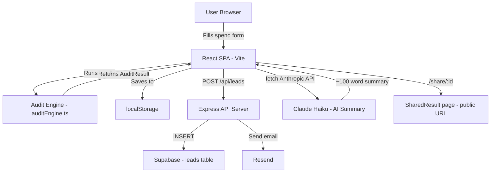

# Architecture

## System Diagram

## Data Flow

1. User fills the spend form (tool, plan, seats, monthly spend, team size, use case)
2. On submit, `runAudit(formState)` runs entirely client-side — no network call
3. The audit result is assigned a `nanoid` and saved to `localStorage`
4. User is navigated to `/results/:id`
5. The results page loads the audit from localStorage and renders recommendations
6. Simultaneously, a fetch to the Anthropic API generates a personalised summary (falls back to a template on failure)
7. If the user submits their email, `POST /api/leads` stores the lead in Supabase and triggers a Resend confirmation email
8. The shareable URL `/share/:id` loads the same audit from localStorage — PII (email, company) is never stored in the audit object itself

## Stack Justification

| Layer | Choice | Why |
|---|---|---|
| Frontend | React + Vite + TypeScript | Fast DX, SPA is sufficient, no SSR needed |
| Styling | Tailwind CSS + custom components | Utility-first, no design system lock-in |
| Routing | React Router v6 | Lightweight, well-known |
| Audit logic | Pure TypeScript functions | Deterministic, testable, no AI hallucination risk |
| AI summary | Anthropic Claude Haiku | Fast, cheap, good at concise prose |
| Backend | Express + TypeScript | Minimal, familiar, easy to deploy anywhere |
| Database | Supabase (Postgres) | Free tier, TypeScript SDK, no infra management |
| Email | Resend | 100/day free, excellent deliverability |
| Tests | Vitest | Native ESM, fast, Vite-native |
| CI | GitHub Actions | Free, integrates with repo |

## Scaling to 10k Audits/Day

- **Audit engine:** Already stateless and client-side — scales to infinity with no backend changes
- **Lead storage:** Supabase free tier handles ~500 inserts/day; upgrade to Pro ($25/mo) for 10k+
- **Email:** Resend free tier is 100/day; upgrade to Starter ($20/mo) for 50k/mo
- **API server:** Add a Redis-backed rate limiter (replace in-memory `express-rate-limit`); deploy behind a load balancer on Fly.io
- **Anthropic API:** Add a queue (BullMQ) to avoid rate limit spikes; cache summaries by audit hash
- **CDN:** Serve the Vite build from Cloudflare Pages for global edge performance
